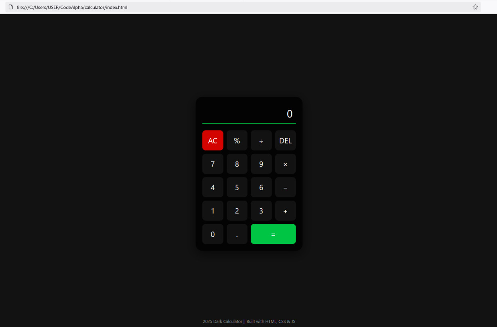

### Dark Calculator
 - A responsive calculator built using HTML, CSS & JavaScript.  
 - Supports keyboard input, real-time expression evaluation, and clean UI design.

 ### Preview
  

### Tech Stacks
- HTML5
- CSS3 (pure)
- JavaScript (ES6)

### Features
- Dark mode only
- Keyboard input support
- Real-time calculations
- Clean, smooth & responsive layout
- Backspace & Clear functions
- No external libraries used

### Demo
 Open the `index.html` in any browser (Compatible Browser).
