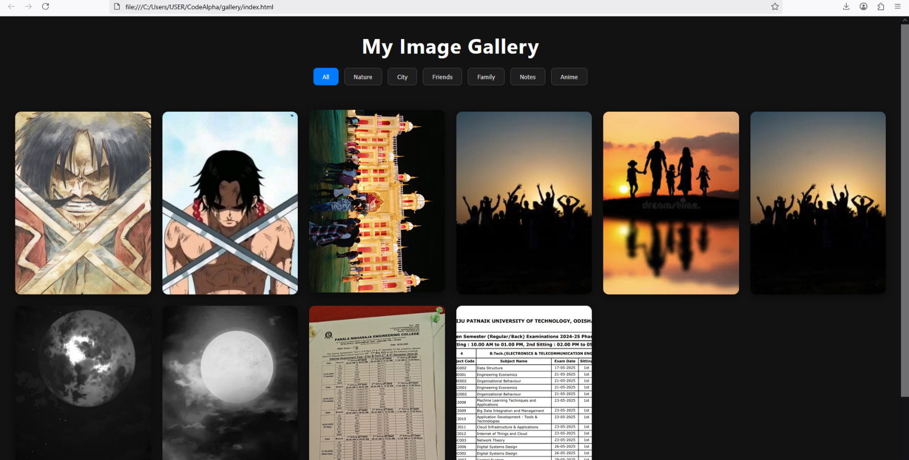

# Image Gallery 
 A responsive image gallery with filtering, hover transitions, and lightbox view using HTML, CSS & JavaScript.

### Preview
 

### Tech Stacks
- HTML5
- CSS3 (pure)
- JavaScript (ES6)

### Features
- Responsive grid layout
- Clean, smooth & responsive layout
- Category filtering
- Lightbox-style image view
- Hover effects
- Smooth transitions

### Demo
 Open the `index.html` in any browser (Compatible Browser)

### NOTE!!!
 You'll have to rewrite the <main> section of `index.html` if you want to add your custom images folder.
