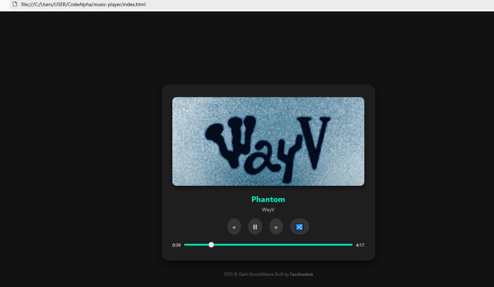

### Dark MusicMania  
 - A sleek, dark-themed web-based music player currently featuring tracks from Ateez & WayV.
 - built using HTML, CSS & JavaScript. Enjoy smooth transitions, responsive design.
 - Has essential playback features like shuffle, seek & real-time metadata display.

### Preview
  

### Features
- Custom playlist with currently 6 songs (ATEEZ & WayV)
- Fully dark UI with glassmorphic effects
- Responsive design
- Play, pause, next, previous track controls
- Auto-loading song metadata (title, artist, cover)
- Real-time progress bar & timestamp syncing
- No external libraries or frameworks used

### Current Playlist
 - ATEEZ- Halazia
 - ATEEZ- Cyberpunk
 - ATEEZ- Inception
 - WayV- All For Love
 - WayV- Love Talk
 - WayV-  Phantom

### How to Run
1. Clone the repo or [Download ZIP](https://github.com/Facelessism/CodeAlpha)  
2. Place your audio files in `assets/songs/`
3. Ensure each song has a matching cover image in `assets/images/`
4. Add new song entries to `script.js` accordingly.
5. Open `index.html` in any modern browser.
6. Make sure to add correct file names & formats (.jpg,.png,mp3,.aac,etc)

### CREDITS
- Built by Facelessism
 Music rights belong to KQ Entertainment(ATEEZ) & SM Entertainmen(WayV)  
- No streaming, redistribution, or external API used  
- For educational/demo purposes only

   *(Btw this works offline after assets are loaded)*